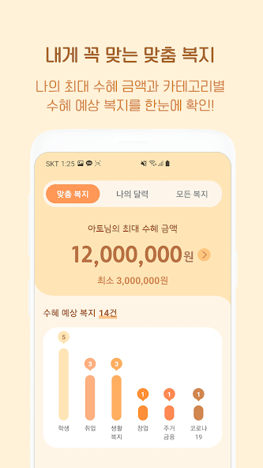
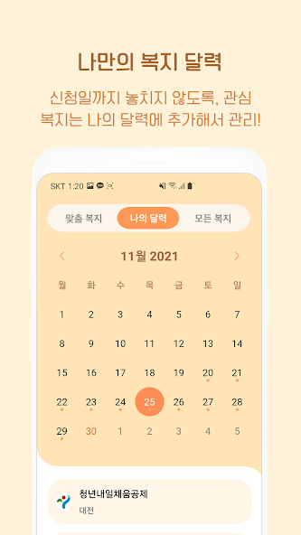
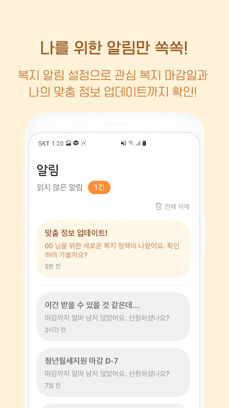
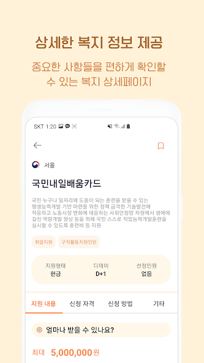

    

<h1 align="center"> KNOWING _ iOS </h1>

  
  
  
  
   

<h3 align="center">
  CMC MakeUS 8TH Project   
  나만의 맞춤 복지정보 제공 서비스 <a href="https://apps.apple.com/kr/app/knowing/id1598340589" target="_blank"> 다운로드</a>
</h3>

 

  
  
  
   
  
  
  
  
   

 

## 📕 Development Environment

- OS : MacOS 12.0.1 M1
- Xcode : 13.2
- Swift : 5.5.2
- cocoapods : 1.11.2
- Target OS : iOS 13.0+
- Design Pattern : MVVM
- Design Framework : UIKit + Snapkit + Then (No storyboard)
- Libraries
  - [RxSwift](https://github.com/ReactiveX/RxSwift)
  - [SnapKit](https://github.com/SnapKit/SnapKit)
  - [Alamofire](https://github.com/Alamofire/Alamofire)
  - [Then](https://github.com/devxoul/Then)
  - [SwiftyJSON](https://github.com/SwiftyJSON/SwiftyJSON)
  - [FSCalendar](https://github.com/WenchaoD/FSCalendar)
  - [SwipeCellKit](https://github.com/SwipeCellKit/SwipeCellKit)
  - [PanModal](https://github.com/slackhq/PanModal)
  - [BetterSegmentedControl](https://github.com/gmarm/BetterSegmentedControl)
  - [lottie-ios](https://github.com/airbnb/lottie-ios)

 

## 🗓 Development

- 2021.10.10 ~ 2021.12.26

 

## 📕 API

1. [Main Server API](https://github.com/developer-hyun/MakeUs/blob/main/src/main/java/com/example/demo/src/main/model/GetAlarmList.java)
2. [Firebase](https://firebase.google.com/)
3. [Naver Login](https://developers.naver.com/main/)
4. [Kakao Login](https://developers.kakao.com/)
5. [Search For universities API](https://www.career.go.kr/cnet/front/openapi/openApiSchoolCenter.do)
6. [Welfare Information API](https://www.youthcenter.go.kr/main.do)

 

